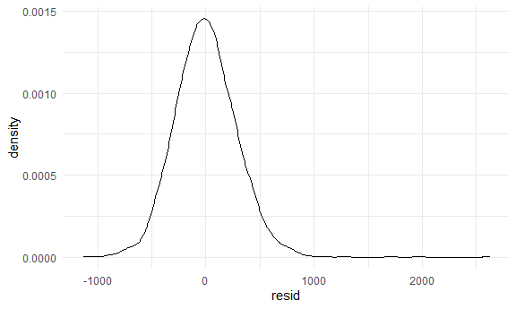
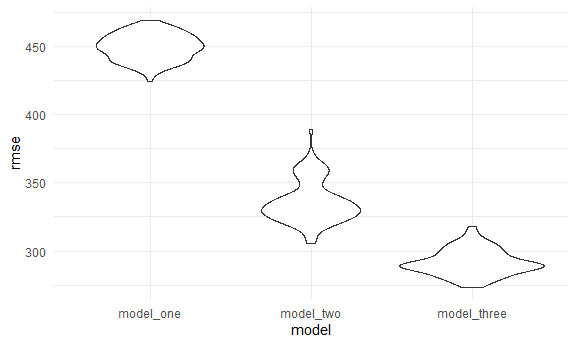

Homework 6
================
Nancy Fang (nf2466)
2020-12-09

### Problem 1

Read in the data

``` r
homicide_df = 
  read_csv("data/homicide-data.csv", na = c("", "NA", "Unknown")) %>% 
  mutate(
    city_state = str_c(city, state, sep = ", "),
    victim_age = as.numeric(victim_age),
    resolution = case_when(
      disposition == "Closed without arrest" ~ 0,
      disposition == "Open/No arrest"        ~ 0,
      disposition == "Closed by arrest"      ~ 1)
  ) %>% 
  filter(
    victim_race %in% c("White", "Black"),
    city_state != "Tulsa, AL") %>% 
  select(city_state, resolution, victim_age, victim_race, victim_sex)
```

    ## Parsed with column specification:
    ## cols(
    ##   uid = col_character(),
    ##   reported_date = col_double(),
    ##   victim_last = col_character(),
    ##   victim_first = col_character(),
    ##   victim_race = col_character(),
    ##   victim_age = col_double(),
    ##   victim_sex = col_character(),
    ##   city = col_character(),
    ##   state = col_character(),
    ##   lat = col_double(),
    ##   lon = col_double(),
    ##   disposition = col_character()
    ## )

For the city of Baltimore, MD, the adjusted odds ratio for solving
homicides comparing non-white victims to white victims keeping all other
variables fixed is 1.363 (95% CI 0.975-1.907) which is not statistically
significant.

``` r
baltimore_df =
  homicide_df %>% 
  filter(city_state == "Baltimore, MD")

glm(resolution ~ victim_age + victim_race + victim_sex, 
    data = baltimore_df,
    family = binomial()) %>% 
  broom::tidy() %>% 
  mutate(
    OR = exp(estimate),
    CI_lower = exp(estimate - 1.96 * std.error),
    CI_upper = exp(estimate + 1.96 * std.error)
  ) %>% 
  select(term, OR, starts_with("CI")) %>% 
  knitr::kable(digits = 3)
```

| term              |    OR | CI\_lower | CI\_upper |
| :---------------- | ----: | --------: | --------: |
| (Intercept)       | 1.363 |     0.975 |     1.907 |
| victim\_age       | 0.993 |     0.987 |     1.000 |
| victim\_raceWhite | 2.320 |     1.648 |     3.268 |
| victim\_sexMale   | 0.426 |     0.325 |     0.558 |

Now run glm for each of the cities in your dataset, and extract the
adjusted odds ratio (and CI) for solving homicides comparing Black
victims to white victims.

``` r
models_results_df = 
  homicide_df %>% 
  nest(data = -city_state) %>% 
  mutate(
    models = map(.x = data, ~glm(resolution ~ victim_age + victim_race + victim_sex, data = .x, family = binomial())),
    results = map(models, broom::tidy)
  ) %>% 
  select(city_state, results) %>% 
  unnest(results) %>% 
  mutate(
    OR = exp(estimate),
    CI_lower = exp(estimate - 1.96 * std.error),
    CI_upper = exp(estimate + 1.96 * std.error)
  ) %>% 
  select(city_state, term, OR, starts_with("CI")) 
```

This plot shows that New York, NY has the lowest odds (less than 1) of
solving a homicide for males compared to females will be resolved by
arrest, when adjusting race, and sex, whereas Albuquerque, NM has the
highest odds of solving a homicide for males compared to females when
adjusting for the same variables. However, neither of them are
statistically significant since the 95% CI crosses 1.

``` r
models_results_df %>% 
  filter(term == "victim_sexMale") %>% 
  mutate(city_state = fct_reorder(city_state, OR)) %>% 
  ggplot(aes(x = city_state, y = OR)) + 
  geom_point() + 
  geom_errorbar(aes(ymin = CI_lower, ymax = CI_upper)) + 
  theme(axis.text.x = element_text(angle = 90, hjust = 1))
```


## Problem 2

Load and clean the data for regression analysis (i.e. convert numeric to
factor where appropriate, check for missing data, etc.).

``` r
baby_df =
  read_csv("data/birthweight.csv", na = c("", "NA", "Unknown"))%>%
  mutate(
    babysex = case_when(
      babysex == "1" ~ "male",
      babysex == "2" ~ "female"),
    smoken = case_when(
      smoken == 0 ~ 0,
      smoken > 0 ~ 1
    )
  )
```

    ## Parsed with column specification:
    ## cols(
    ##   .default = col_double()
    ## )

    ## See spec(...) for full column specifications.

Propose a regression model for birthweight:

Initially, I proposed that a mother’s prepregnancy GMI, weight gain
during pregnancy, and smoking status would all be important variables to
include into my model. However, we see that there is a left skew of the
residuals, which led me to believe that there may be other variables in
the dataset that are important to include in my model.

``` r
model_test = 
  lm(bwt ~ ppbmi + wtgain + smoken, data = baby_df)

model_test_df = 
  baby_df %>%
  modelr::add_residuals(model_test)

model_test_plot = 
  model_test_df %>%
  ggplot(aes(x = resid)) + 
  geom_density()
```

I then hypothesized that gestational age would be an important
covariate, since birthweight should be directly correlated with how far
along a pregnancy is before delivery. I used a residual v. predictor
plot to test this hypothesis and it looked like there was a linea
relationship between residuals of my initial model and predictions in a
model between birthweigt and gestational age.

``` r
model_ga = 
  lm(bwt ~ gaweeks, data = baby_df)

model_test_df %>%
  modelr::add_predictions(model_ga)%>%
  ggplot(aes(x= pred, y = resid)) +
  geom_point()
```


I then proposed that mother’s prepregnancy BMI, weight gain during
pregnancy, smoking status AND gestational age affects birthweight. The
residual plot of this model was more symmetrical around 0 (with a mild
left skew).

``` r
model_1_fit = lm(bwt ~ ppbmi + wtgain + smoken + gaweeks, data = baby_df)


model_1_df = 
  baby_df %>% 
  modelr::add_residuals(model_1_fit)%>%
  mutate(
    model = "model_one"
  )%>%
  select(model, bwt, resid)

  model_1_df %>%
  ggplot(aes(x = resid)) + 
  geom_density()
```


Fit model with length at birth and gestation age model

``` r
model_2_fit = lm(bwt ~ gaweeks + blength, data = baby_df)

model_2_df =
  baby_df %>% 
  modelr::add_residuals(model_2_fit) %>%
  mutate(
    model = "model_two"
  )%>%
  select(model, bwt, resid)

model_2_df %>% 
  ggplot(aes(x = resid)) + 
  geom_density()
```


Fit model with head circumference, length, sex, and all interactions

``` r
model_3_fit = lm(bwt ~ bhead * blength * babysex, data = baby_df)

model_3_df = 
  baby_df %>% 
  modelr::add_residuals(model_3_fit) %>%
  mutate(
    model = "model_three"
  )%>%
  select(model, bwt, resid)

model_3_df %>% 
  ggplot(aes(x = resid)) + 
  geom_density()
```



Now perform cross validation of the three models

``` r
cv_df = 
  crossv_mc(baby_df, 100) 

cv_df =
  cv_df %>% 
  mutate(
    train = map(train, as_tibble),
    test = map(test, as_tibble))

cv_df = 
  cv_df %>% 
  mutate(
    model_one  = map(train, ~lm(bwt ~ ppbmi + wtgain + smoken + gaweeks, data = .x)),
    model_two  = map(train, ~lm(bwt ~ gaweeks + blength, data = .x)),
    model_three  = map(train, ~lm(bwt ~ bhead * blength * babysex, data = .x))) %>% 
  mutate(
    rmse_model_one = map2_dbl(model_one, test, ~rmse(model = .x, data = .y)),
    rmse_model_two = map2_dbl(model_two, test, ~rmse(model = .x, data = .y)),
    rmse_model_three = map2_dbl(model_three, test, ~rmse(model = .x, data = .y)))

cv_df %>% 
  select(starts_with("rmse")) %>% 
  pivot_longer(
    everything(),
    names_to = "model", 
    values_to = "rmse",
    names_prefix = "rmse_") %>% 
  mutate(model = fct_inorder(model)) %>% 
  ggplot(aes(x = model, y = rmse)) + geom_violin()
```



From our plot, we see that model three (birthweight predicted by head
circumference, body legnth, sex and its interactions) is the best fitted
model of the three that were proposed.

## Problem 3

``` r
weather_df = 
  rnoaa::meteo_pull_monitors(
    c("USW00094728"),
    var = c("PRCP", "TMIN", "TMAX"), 
    date_min = "2017-01-01",
    date_max = "2017-12-31") %>%
  mutate(
    name = recode(id, USW00094728 = "CentralPark_NY"),
    tmin = tmin / 10,
    tmax = tmax / 10) %>%
  select(name, id, everything())
```

    ## Registered S3 method overwritten by 'hoardr':
    ##   method           from
    ##   print.cache_info httr

    ## using cached file: C:\Users\DTom\AppData\Local\cache/R/noaa_ghcnd/USW00094728.dly

    ## date created (size, mb): 2020-12-08 20:37:03 (7.552)

    ## file min/max dates: 1869-01-01 / 2020-12-31

Create linear model

``` r
lm(tmax ~ tmin, data = weather_df) %>% 
  broom::tidy() %>% 
  knitr::kable(digits = 3)
```

| term        | estimate | std.error | statistic | p.value |
| :---------- | -------: | --------: | --------: | ------: |
| (Intercept) |    7.209 |     0.226 |    31.847 |       0 |
| tmin        |    1.039 |     0.017 |    61.161 |       0 |

Bootstrapping: From our density plots, we see that the r-square
estimates concentrate between 0.91 and 0.92 and the
log(beta\_0\*beta\_1) concentrates between 2.00 and 2.05. The r-square
value shows that our linear model provides a good fit for our dataset.

``` r
rsquare_df =
weather_df %>% 
  modelr::bootstrap(n = 5000) %>% 
  mutate(
    models = map(strap, ~lm(tmax ~ tmin, data = .x) ),
    results = map(models, broom::glance))%>%
  unnest(results)

rsquare_df %>% 
  ggplot(aes(x = r.squared)) + 
  geom_density()
```


``` r
log_beta_df =
weather_df %>% 
  modelr::bootstrap(n = 5000) %>% 
  mutate(
    models = map(strap, ~lm(tmax ~ tmin, data = .x) ),
    results = map(models, broom::tidy)) %>% 
  group_by(.id)%>%
  unnest(results)%>%
  select(.id, term, estimate)%>%
  pivot_wider (names_from = term, values_from = estimate)%>%
  mutate(
    log_beta = log(`(Intercept)`*tmin))

log_beta_df %>% 
  ggplot(aes(x = log_beta)) + 
  geom_density()
```


Calculate 95% CI for r-square estimates: We see that the CI does not
cross 0.

``` r
CI(rsquare_df$r.squared, ci=0.95)%>% 
  knitr::kable(digits = 3)
```

|       |     x |
| :---- | ----: |
| upper | 0.912 |
| mean  | 0.912 |
| lower | 0.911 |

Calculate 95% CI for log(beta\_0\*beta\_1) estimates: We see that the CI
does not cross 0.

``` r
  CI(log_beta_df$log_beta, ci=0.95)%>% 
  knitr::kable(digits = 3)
```

|       |     x |
| :---- | ----: |
| upper | 2.013 |
| mean  | 2.013 |
| lower | 2.012 |
